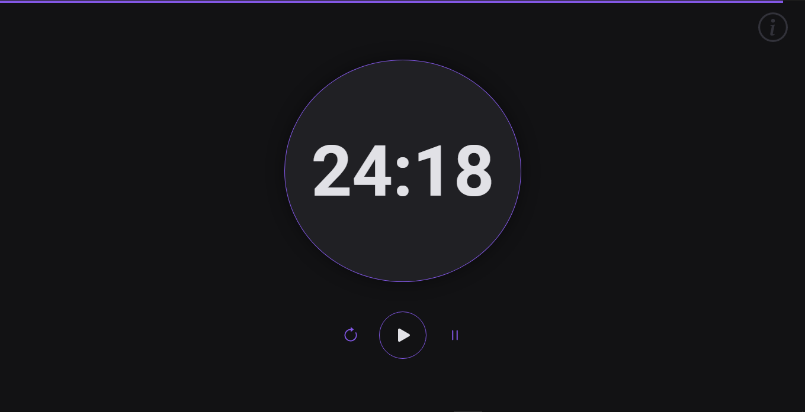
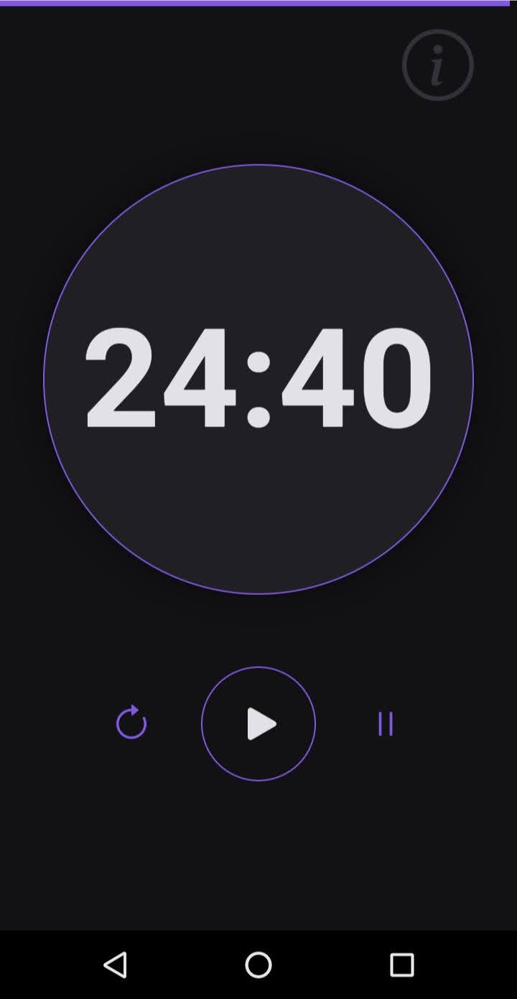

# Pomodoro-Timer
Projeto Front end, um relógio pomodoro feito em html, css e javascript puro.
Toda explicação de como utilizar o relógio já esta no próprio site.
<h2>Screenshot funcionando</h2>
</img>

<h2>Screenshot responsivo</h2>
</img>
